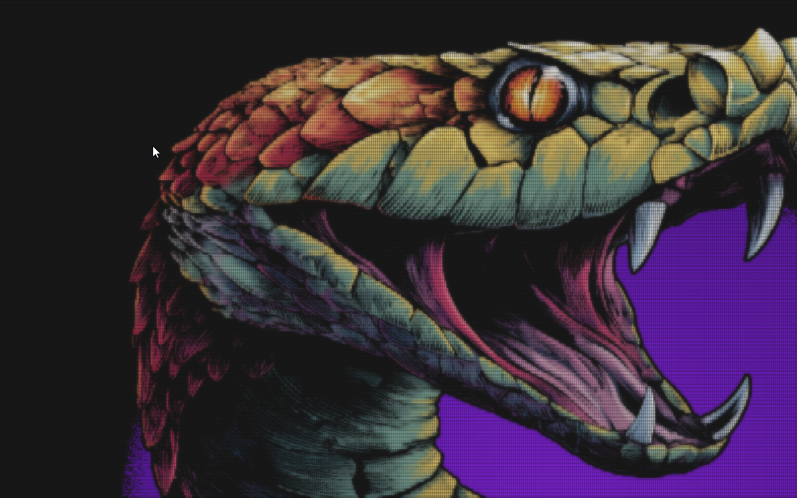
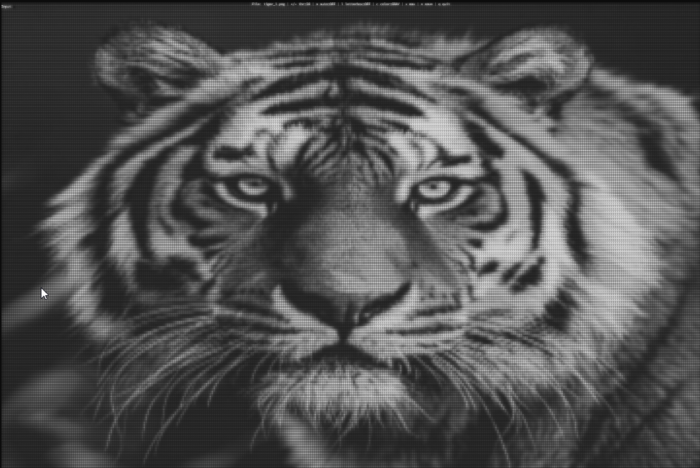
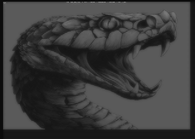
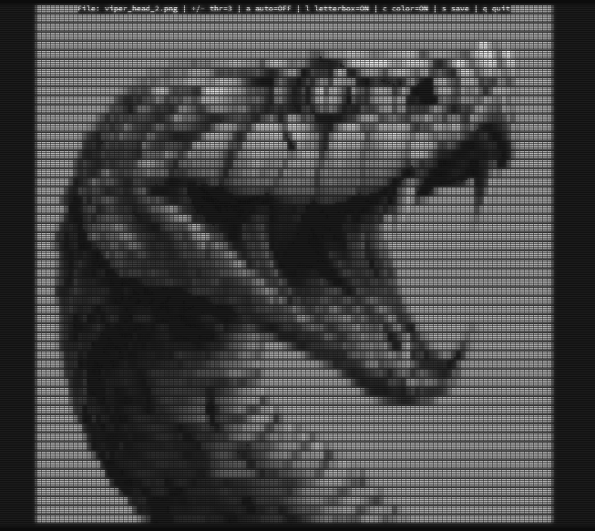
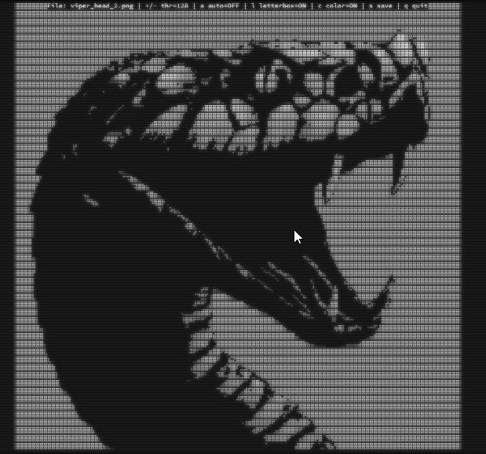
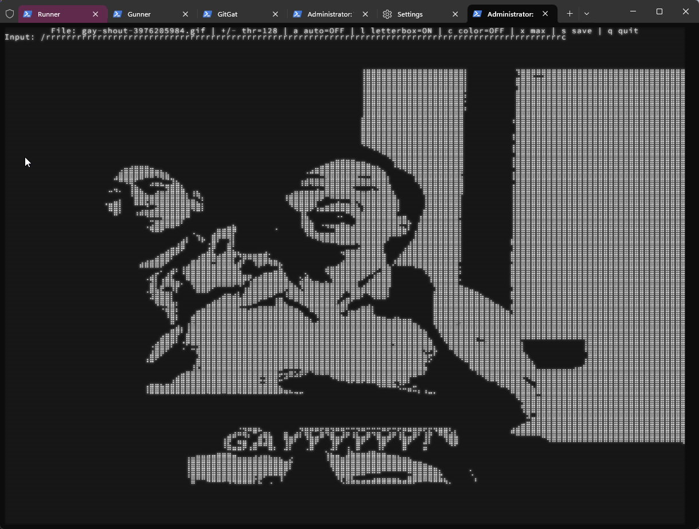
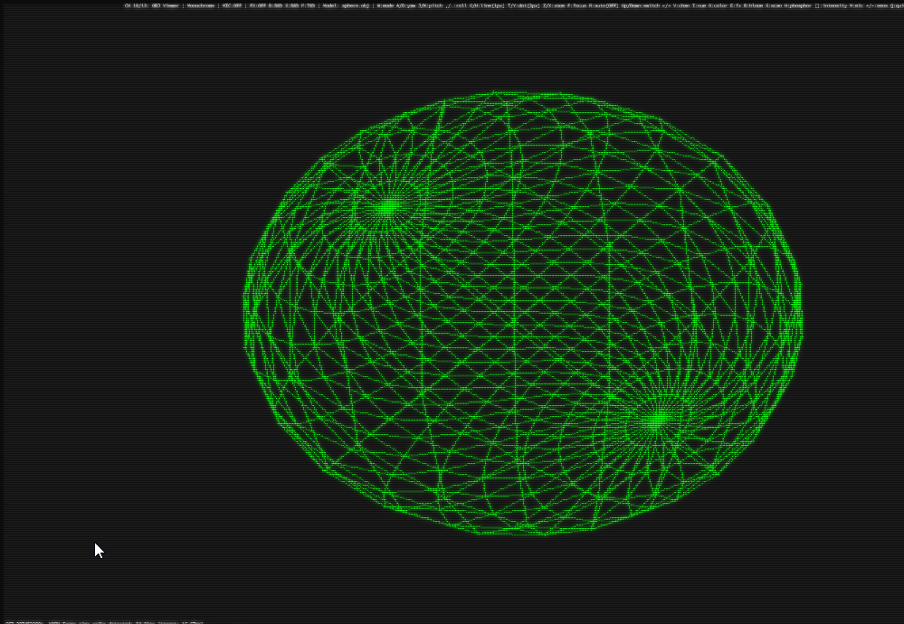
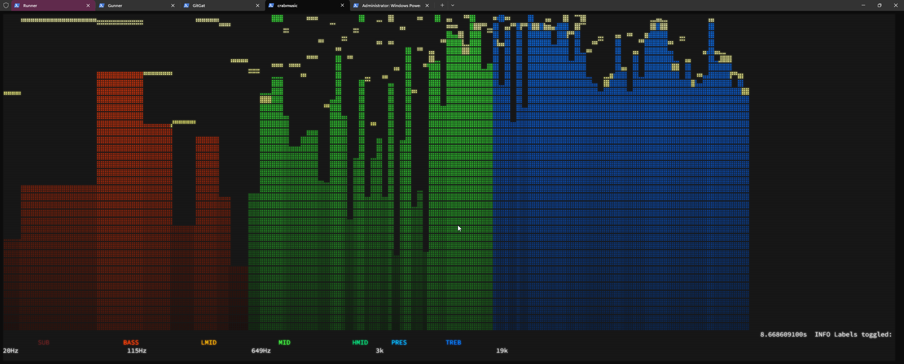

# dotmax

Render anything in terminal braille. Images, GIFs, videos, webcam - one line of code.

[](https://crates.io/crates/dotmax)
[](https://docs.rs/dotmax)
[](https://github.com/newjordan/dotmax#license)

**Browse the live style catalog: [dotmax-sable.vercel.app](https://dotmax-sable.vercel.app)**

## 676 loading animations, built in

`dotmax::progress` ships 676 loading bars, spinners, borders, wipes and meters
across 60 themes (fable, matrix rain, synthwave, demoscene, aurora, fire, glitch, fireworks, fractals,
cellular automata, sacred geometry, retro consoles, ...). Every style is a
stateless pure function of `(progress, time)` — preview them all running live
on [the site](https://dotmax-sable.vercel.app), then take any of them home as a
dotmax snippet, a dependency-free standalone `.rs` file, or a plain shell
script.

```rust
use dotmax::progress::{styles_for_theme, render_string, BarContext, Easing};

let styles = styles_for_theme("matrix");
let ctx = BarContext::new(0.42, 1.5, 44, 4).with_easing(Easing::CubicInOut);
println!("{}", render_string(styles[0].as_ref(), &ctx).unwrap());
```

## Gallery

### Color Rendering

| | |
|---|---|
|  |  |
| Full-color image rendering with braille dots | Color rendering with tuner overlay |
|  |  |
| High-detail color closeup | Medium-resolution color render |

### Monochrome & Pixel Sizes

| | |
|---|---|
|  |  |
| 8px monochrome braille | Small pixel density |
|  |  |
| Small pixel snake render | Large pixel with shading enabled |
|  |  |
| Large pixel monochrome | Animated GIF playback in terminal |

### 3D, Audio & More

| | |
|---|---|
|  |  |
| 3D sphere wireframe (OBJ rendering) | Sphere with I/O overlay |
|  |  |
| 3D snake head model | Audio spectrograph visualization |
|  | |
| Grid/oscilloscope formation | |

## Install

```bash
cargo add dotmax --features image
```

## One-Line Usage

```rust
use dotmax::quick;

quick::show_file("photo.png")?;    // Any image
quick::show_file("cat.gif")?;      // Animated GIF (plays automatically)
quick::show_file("movie.mp4")?;    // Video (requires 'video' feature)
quick::show_webcam()?;             // Live webcam (requires 'video' feature)
```

## Visual Examples

Here's what dotmax output looks like. Each terminal cell uses Unicode braille characters (2x4 dots) for 8x the resolution of ASCII art.

**Macro photography (ant):**
```
⢸⢐⠕⡌⢆⠕⢌⢂⠆⡂⡢⢂⢂⢂⢂⠢⠡⡂⠕⡨⢂⠪⡐⠌⢔⠐⢔⠐⠔⡐⡐⡐⡐⡐⡐⡐⢐⠐⡀⢂⠐⡀⠄⠄⠠⠀⠄⠐⡀⢐⢀⠂⡂⡂⡂⡂⡂⢂⠂⡐⠠⠐⢀⠐⢀⠂⡐⠐⡐⢐⠐⡐⢐⠐⡐⡐⡐⡐⡐⢐
⢪⠢⡣⡪⢢⠣⡑⢔⠡⡂⡢⢂⢂⢂⠂⢅⢑⢐⠅⡊⠔⡁⡢⢑⢐⠡⠂⠅⠅⡂⡂⡂⡂⡂⡂⢂⢂⢂⠐⡀⢂⠠⠐⠀⠂⠁⠄⢁⠀⢂⠀⡂⢐⠀⢂⠐⠐⡀⠂⠄⠂⠐⢀⠐⢀⠐⢀⠁⠄⠂⢐⠀⢂⠐⠠⠐⢀⠐⡀⠂
⢕⢕⢕⢜⢔⠕⢅⠣⡑⢔⠰⡐⡐⢄⢑⢐⠔⡐⠌⡂⠕⡨⠠⠡⢂⠊⠌⠌⡂⡂⡂⡂⡂⠢⠨⢐⢀⠂⡐⠠⠀⠄⠂⢁⠈⠄⠂⠠⠐⠀⠄⠐⢀⠈⠠⠀⡁⠀⠂⡀⠂⠁⢀⠠⠀⠐⠀⠐⠀⡁⠄⠐⠀⠄⠁⠐⠀⠂⢀⠁
⢕⢕⢕⠕⡜⡘⡌⡪⡨⠢⡑⡐⠌⠔⡐⡐⡐⠌⢌⢐⠡⠂⢅⠑⠄⠅⠅⡡⠂⡂⡂⠢⠨⠨⡈⠄⢂⠐⡀⠂⠐⠀⠂⡀⠄⠐⠀⠂⠀⠂⠐⠈⠀⠀⠂⠠⠀⢈⠀⠀⠄⠂⠀⢀⠠⠈⠀⢈⠀⠀⡀⠄⠁⢀⠈⠀⠁⠈⠀⠀
⢕⢕⢕⢱⠡⡣⡊⢆⠪⡨⢂⠪⠨⠨⡐⡐⠨⠨⠐⠄⠅⠅⠅⠌⠌⠂⠅⡐⡐⡐⠄⠅⠅⠅⡂⠌⠄⢂⠐⢈⠀⡁⠄⠀⠠⠐⠈⠀⠁⠈⢀⠐⠈⠀⠈⢀⠠⠀⠀⠂⠀⡀⠐⠀⠀⠀⠈⠀⠀⢀⠀⠀⢀⠀⠀⠈⠀⠀⠁⠀
⢕⢕⢱⢡⠣⡪⠨⡢⡑⢌⠢⠡⠃⢅⠂⠌⠌⠌⠌⠌⠌⠌⠌⡨⠈⠌⡐⢐⢀⠢⠨⢈⠌⡐⢄⢑⠨⢐⠈⠄⢂⠠⠐⠈⢀⠠⠀⠂⠈⠀⡀⠀⠄⠈⢀⠀⢀⠠⠐⠀⢀⠀⠀⠄⠐⠈⠀⠀⠂⠀⠀⠠⠀⠀⠀⠁⠀⠈⠀⡀
⢕⠕⡅⢇⢕⢘⢌⢂⠪⡐⡡⠡⡑⠄⠅⠅⠅⠅⠅⠅⠅⠅⠡⠠⠁⠅⡐⠐⡀⣂⢑⠄⡂⢌⢐⢐⠨⢐⠨⠨⡐⠄⠅⠌⠠⢀⠐⡀⠂⠁⠀⠀⠄⠐⠀⠀⠀⠀⠀⡀⠀⠠⠀⢀⠀⠀⡀⠄⠀⠀⠂⠀⠀⠀⠂⠀⠂⠀⠁⠀
⢪⢊⢎⢊⠢⡑⠔⡡⠡⢂⠢⡁⠢⠡⠡⠡⠡⠡⢡⢁⠅⠌⠨⠀⠅⠂⠄⠡⠐⠰⠠⠂⡢⠠⠡⢐⠈⠢⡡⡑⢔⠡⡡⡡⡑⡐⡐⠠⢂⠈⠄⢁⠠⠀⠐⠈⠀⠁⡀⠀⠄⠂⠀⢀⠀⢀⠀⠀⠀⠐⠀⠀⠈⠀⠀⡀⠀⠠⠀⠀
⡑⠕⢌⠪⠨⡂⠕⠠⡑⠄⠅⡂⠅⠅⡡⠁⠅⠅⢂⠂⡉⠪⠄⡅⠈⠄⠈⠄⡈⠄⠡⠡⠀⡊⡐⠀⠌⡪⢐⢌⢆⢣⠪⡰⡨⡂⢎⢌⠢⡨⠨⡠⠂⢌⢐⠡⢈⠄⡂⠨⢀⢐⠈⡀⠄⠠⠀⠄⠁⠠⠐⠈⠀⡀⠂⠀⠠⠀⡀⠂
⡘⠜⡐⠅⠕⡠⠡⡁⡂⠅⡁⡂⠡⠡⠠⠡⠡⠈⠄⢂⠐⠐⠄⡈⠘⢠⢁⢂⠐⡨⢐⠡⡢⡀⠄⠂⡐⢜⢔⢱⢱⢱⢱⢱⢸⢸⢨⢢⠣⡊⡎⢔⢅⠕⡔⢌⢢⢂⢪⠨⡂⡢⢨⢐⠨⡐⠡⠨⡈⡐⡐⡈⠄⡂⠨⡀⠅⡠⠠⢀
⠨⠨⢐⠡⢁⠂⠅⡐⢐⠐⡐⠠⠑⡈⠄⠡⠈⢄⠡⠐⠠⢁⠂⠔⡁⡢⠠⡂⡈⡢⡡⡑⡆⡕⡕⡁⠢⠁⢕⠂⣎⢮⢺⡸⡱⣕⢵⢱⡹⡸⡸⡸⡸⡸⡸⡸⡸⡸⡰⡱⡸⡨⡢⡱⡑⡌⡎⡪⡰⢨⠢⡨⡂⣊⠢⡢⡑⡐⢌⠔
⠨⠨⢐⠈⠄⢌⢐⢐⢐⠐⡠⢁⢂⠂⠌⠌⢌⢐⠌⢌⢌⠢⡡⡑⡌⢆⢇⢎⢪⢢⡀⠣⡣⡣⡃⠄⢁⠈⡐⠨⡺⣜⢵⡹⡺⡜⣎⢧⢳⡹⣪⢳⡹⡜⡮⡺⡜⡮⡺⣸⢪⢎⢮⡪⣎⢮⢪⡪⡪⡪⡪⡪⡪⡢⡣⡣⡪⡪⡢⡣
⢌⢌⠔⢌⢪⠰⣐⢢⢢⠱⡐⡅⡢⡑⡕⡑⡕⢔⢱⢑⢔⢕⢜⢌⢎⢎⡎⡮⡺⣸⡪⡦⣈⠑⠇⡐⢐⢄⠠⠀⢕⡗⡵⣝⢮⡫⡮⡳⡳⣹⢪⢧⢳⢝⢮⡳⣝⢮⡫⡮⡳⣝⢵⢝⡼⣪⢧⡳⣝⢮⢳⡹⣜⢮⢳⡹⡜⣎⢮⡪
⡪⡢⡝⡜⣜⢜⡜⣜⢜⢼⡸⣸⢸⢜⢜⡜⣜⢜⡎⡮⣣⢳⢕⣝⢎⡧⡳⡝⡮⣣⡳⣝⢎⡧⡧⡲⣝⡢⡂⢔⠨⡺⣝⢎⡧⠏⠊⡡⢴⡈⢗⡽⣕⢯⢳⢕⣗⢵⢝⡮⡯⣺⢝⡵⣫⢞⡵⣝⢮⡳⣝⢞⢮⡳⡳⣕⢯⢎⡧⣫
⢧⡫⡮⣫⢎⣗⣝⢮⡳⣣⢯⣪⡳⣝⢵⢝⣎⢗⣝⢞⢮⡳⣝⢮⡳⣝⣝⢮⡫⣞⢞⢮⡳⡳⣝⡝⢪⢐⢌⠂⠌⠚⠎⠃⠀⡤⣺⡪⣗⢗⠌⢞⢮⡳⣝⢵⡳⣝⢵⡫⣞⢵⣫⢞⡽⣕⡯⣞⢗⡽⣪⢯⡳⣝⣝⢮⡳⣝⢮⡳
⣗⢽⡪⣗⢽⡪⡮⣳⢝⡮⣳⢵⢝⡮⣳⢝⡮⣳⢕⡯⣳⢝⡮⣳⢝⣞⢮⡳⡽⣪⢯⠳⠙⢉⣠⢴⣳⠣⢣⢆⠌⠐⠠⠨⠰⣈⣞⢞⡮⡯⣳⡈⢗⡽⣪⢗⡽⣪⢗⡽⣪⢗⣗⢽⡪⣗⢽⡪⣗⡽⣕⣗⣝⢮⢮⡳⣝⢮⡳⣝
⡮⣳⣫⢞⣗⢽⢝⡮⣳⣝⢮⣳⣫⢾⢝⡵⣫⣞⡵⣻⡪⣗⡽⡵⣻⡪⣗⢯⢋⢅⡴⡴⣝⢗⣗⢽⡺⣨⣠⢈⢀⠐⢌⢊⢕⢜⢮⣳⢽⡺⣕⣧⡈⢾⢝⡵⣻⡪⣗⡽⣪⢗⡵⣫⢞⡵⡯⣞⡵⣫⢞⡮⡮⣳⡳⣝⢮⡳⡽⣺
⢯⡺⡮⣳⢽⡹⣵⡫⣗⡵⡯⣺⡪⣗⢯⡫⣞⢮⣺⢵⢝⣞⢮⢯⢮⠯⢊⢦⢯⣫⢾⢝⡮⣗⢗⣽⡺⣕⣗⢑⡢⣣⢕⠕⠌⢎⣳⢳⣝⢾⢕⣗⢵⡨⢯⡺⡵⣫⣞⢞⡽⣕⢯⣳⡫⡯⣞⡵⣫⣗⢯⣞⢽⡺⣺⣪⢗⡯⡯⣺
⢯⣺⢝⡮⣗⡽⣺⡪⣗⡽⣺⢵⡻⣪⣗⡽⣵⣻⣪⢯⣳⡳⣝⡮⢃⡵⣝⣗⢽⣪⢯⡳⣝⢮⢯⡺⡮⣳⡣⢺⢜⠕⢕⢡⠡⡑⡬⣳⡳⡽⣕⢗⣗⣕⢕⢯⡫⣞⢮⢯⡺⡵⣻⡪⡯⣫⣞⢽⢕⡷⣝⢮⣳⣫⡳⡵⣻⣪⢯⣳
⡯⣺⣝⢾⢵⣫⢞⡮⣳⢽⢮⣳⣝⢷⢵⢯⢞⡮⣺⢵⡳⣝⢇⣗⢽⢝⣞⢮⡳⣓⢗⢝⢎⢗⢝⠮⣫⢳⠡⡫⡣⡢⡂⡐⢐⠨⡪⣗⡽⣺⣪⢗⡵⣳⢌⢷⢝⡾⣝⣵⣫⢯⢞⡮⡯⣳⢵⣫⢷⢝⣞⣝⢮⡺⡮⣻⡪⣞⡵⣳
⢯⣳⢵⢯⢷⢯⣻⡺⣝⢮⣳⡳⣝⡽⣹⢵⡻⢮⡳⡝⣎⢞⣞⢮⢯⣳⢳⡳⣝⢵⡫⡮⡳⡵⡱⣕⡕⡕⣘⢸⢘⢳⢡⠈⢂⢡⡫⣞⢽⣪⢾⢽⢝⣞⡵⡹⣝⣞⢗⣗⢷⢽⣝⣞⢽⡳⣫⣞⡽⣝⢞⢮⢯⢯⢯⡺⣝⣞⢮⢗
⢯⡪⣗⢯⣳⣝⢮⣺⢳⢽⣪⡻⡮⣻⣪⣗⢯⣣⡳⡽⣜⡽⡺⣝⡮⣺⡕⣟⢾⢝⣞⡽⣝⢮⡻⣺⡪⣇⢮⡪⣪⡰⣐⢑⢄⢒⣙⢮⣳⡳⣕⢵⣹⢺⡪⣗⡕⡗⡯⣞⡽⣕⢷⢵⡻⣺⢵⡳⣝⢮⣫⢗⣽⣪⡳⣝⡵⣳⢽⢝
⣗⢽⣺⣪⣻⡪⣗⢯⢞⡽⣪⢯⢞⣵⣫⡾⣝⣗⢯⢯⢞⡽⣝⣞⡵⡯⣺⢵⣳⣫⣞⣞⢽⣺⣪⢗⡽⡽⣵⣫⣗⣗⡯⡯⣗⣗⡯⣗⡽⣳⣝⢾⢕⣗⡵⣫⣞⡵⣫⣞⢵⢽⢝⡮⡯⣺⢕⣯⡺⣝⣵⣫⢗⣽⡪⣗⡽⣪⣗⢽
```

**Landscape scene:**
```
⡯⡯⡯⡯⡯⡯⡯⡯⡯⡯⡯⡯⡯⡯⡯⡯⡯⡯⡯⡯⡯⡯⡯⡯⡯⡯⡯⡯⡯⡯⡯⡯⡯⡯⡯⡯⡯⡯⡯⡯⡯⡯⡯⡯⡯⡯⡯⡯⡯⡯⡯⡯⡯⡯⡯⡯⡯⡯⡯⡯⡯⡯⡯⡯⡯⡯⡯⡯⡯⡯⡯⡯⡯⡯⡯⡯⡯⡯⡯⡯
⡯⡯⡯⡯⡯⡯⡯⡯⡯⡯⡯⡯⡯⡯⡯⡯⡯⡯⡯⡯⡯⡯⡯⡯⡯⡯⡯⡯⡯⡯⡯⡯⡯⡯⡯⡯⡯⡯⡯⡯⡯⡯⡯⡯⡯⡯⡯⡯⡯⡯⡯⡯⡯⡯⡯⡯⡯⡯⡯⡯⡯⡯⡯⡯⡯⡯⡯⡯⡯⡯⡯⡯⡯⡯⡯⡯⡯⡯⣯⣻
⡯⡯⡯⡯⡯⡯⡯⣯⢯⢯⢯⡯⡯⡯⡯⡯⡯⡯⡯⡯⡯⡯⡯⡯⡯⡯⡯⡯⡯⡯⡯⡯⡯⡯⡯⡯⡯⡯⡯⡯⡯⡯⡯⡯⡯⡯⡯⡯⡯⡯⡯⡯⡯⡯⡯⡯⡯⡯⡯⡯⡯⡯⡯⡯⡯⡯⡯⡯⡯⡯⡯⣗⣗⣗⣗⣗⣗⣗⣗⡯
⡯⡯⡯⡯⡯⡯⡯⣗⡯⣟⣽⣺⢽⣫⢯⣟⡽⣽⣫⢯⣟⡽⣽⣫⢯⣟⡽⣽⣫⢯⢯⣻⢽⢽⢽⠽⡝⣝⢭⡫⡝⣝⢽⢹⢹⢽⢽⢽⣝⡯⣯⣻⢽⣝⡯⣯⣻⢽⣝⡯⣯⣻⢽⣝⡯⣯⣻⢽⣝⡯⡯⣗⣗⣗⣗⣗⡷⣳⣳⣻
⡯⡯⡯⡯⡯⡯⡯⣗⡯⣗⡷⡽⣽⣺⢽⢮⣻⣺⣺⢽⢮⣻⣺⣺⢽⢮⣻⣺⣺⢽⢽⡺⡝⢕⢃⠣⢑⢐⠔⢨⠨⠨⢊⠂⢧⢳⡫⣗⣗⢯⢷⣝⣗⣗⡯⡷⣝⣗⣗⡯⡷⣝⣗⣗⡯⡷⣝⣗⣗⡯⡯⣗⣗⣗⡯⡾⣝⣗⢷⢽
⡯⡯⡯⡯⡯⡯⡯⣗⡯⣗⡯⣟⣞⢾⢽⢽⣺⣺⣺⢽⢽⣺⣺⣺⢽⢽⣺⡺⡮⡯⡳⡑⢅⠑⠄⠅⢅⢂⠊⠔⡨⠨⢂⢑⢐⠅⡫⡺⡮⡯⣗⣗⣗⣗⡯⡯⣗⣗⣗⡯⡯⣗⣗⣗⡯⡯⣗⣗⣗⡯⡯⣗⡯⡾⡽⣝⢷⢽⢽⢽
⡯⡯⡯⡯⡯⡯⣟⣵⣻⡳⡯⡷⡽⡽⡽⣽⣺⣺⣺⢽⢽⣺⣺⣺⢽⢽⢮⢯⣫⢚⢐⠌⡂⠅⠕⠡⡁⡢⠡⢑⠄⠅⢅⢂⠢⢂⢂⢂⠣⡯⣺⣺⡺⣪⢯⢯⢗⣗⣗⡯⡯⣗⣗⣗⡯⡯⣗⣗⣗⡯⡯⣗⡯⡯⡯⡯⡯⡯⡯⣯
⡯⡯⡯⡯⡯⡯⣗⣗⣗⡯⡯⡯⡯⣯⣻⣺⣺⣺⣺⢽⢽⣺⢞⡾⡽⡽⡽⡵⡑⠌⠔⡐⠌⠌⢌⠌⠔⡠⢑⢐⠌⢌⢂⠢⠑⠄⢅⠢⢑⠜⠪⢺⢺⢕⢯⢯⣻⣺⡺⡽⣝⣗⣗⣗⡯⡯⣗⡷⣳⢯⢯⣗⡯⣯⢯⢯⢯⢯⣻⣺
⡯⡯⡯⡯⡯⡯⣗⡯⡾⡽⡽⡽⣽⣺⣺⣺⣺⣺⣺⢽⢽⣺⢽⢽⢽⢽⢮⢇⠣⠡⡑⡐⡡⠡⠡⠨⡂⢌⢂⢂⠊⠔⡠⠡⠡⡡⠡⢊⠐⠌⣏⣖⢦⡳⡽⡵⣳⡳⡽⣝⣗⣗⣗⣗⡯⣯⢗⡯⡯⡯⣗⣗⡯⣗⡯⣯⢯⣟⣞⣞
⡯⡯⡯⡯⡯⡯⣗⡯⡯⡯⣯⣻⣺⣺⣺⣺⣺⣺⣺⢽⢽⣺⢽⢽⣝⣗⢽⠨⡨⠨⡐⡐⡐⡡⢑⠡⠂⢅⢂⠢⠡⡑⠄⠕⡁⡢⢑⢐⠡⡑⠌⢮⢳⢽⢝⡽⣪⢯⢯⣳⣳⣳⣳⣳⢯⣗⡯⣯⢯⢯⣗⣗⡯⣗⡯⣗⣟⣞⣞⣞
⡯⡯⡯⡯⡯⡯⣗⡯⡯⣟⣞⣞⣞⣞⣞⣞⣞⡾⣺⢽⢽⣺⢽⣳⡳⣕⠇⠕⡠⢑⢐⢐⠔⡐⡡⠨⡨⢂⠢⠡⡑⠌⡌⡢⢂⠢⢂⠢⡁⠢⠡⡁⡣⠫⡫⡺⣕⢯⣳⣳⣳⣳⣳⣝⣗⣗⡯⣗⡯⣟⣞⡮⡯⣗⡯⣗⣗⣗⢷⢽
⡯⡯⡯⡯⡯⡯⣗⡯⣯⢗⣗⣗⣗⣗⣗⣗⣗⡯⡯⡯⣻⡪⣗⢗⡝⣎⢎⢌⠔⢔⠢⡑⢌⠢⢊⠌⠔⡐⠡⠡⢂⠕⡐⢌⠢⡑⠅⢆⢪⠨⡨⢐⠱⡝⡮⡯⣺⢽⣺⣺⣺⣺⣺⣺⡺⡮⣯⡳⡯⣗⣗⡯⡯⣗⡯⣗⣗⡯⡯⣯
⡯⡯⡯⡯⡯⡯⣗⡯⣗⡯⣗⣗⣗⡷⣳⢯⢞⡝⡝⠜⡡⢃⠅⢕⠨⢂⠕⡐⢅⠑⢌⢐⠡⠨⢂⠌⠌⠔⡡⠡⠡⢂⠌⠢⡈⠢⢑⠡⢂⠕⡘⢔⢑⠕⢍⢍⠳⡹⢚⠮⣞⢮⣞⣞⢾⣝⡮⡯⡯⣗⣗⡯⡯⣗⡯⣗⣗⡯⣟⣞
⡯⡯⡯⡯⡯⡯⣗⡯⣗⡯⣗⡯⡾⣝⣗⢯⠣⡃⠢⠑⠄⢅⢊⠐⠌⠔⡐⠌⠄⠅⢅⢂⠅⠅⢅⠌⡊⠌⠄⢅⠅⢅⠊⢌⠐⠅⢅⠊⠔⡨⢐⢐⠔⠡⡁⡢⠨⡐⠡⡑⠌⡳⣳⡳⣽⣺⡺⡽⣝⣗⣗⡯⡯⣗⡯⣗⡯⣞⡷⡽
⡯⡯⡯⡯⡯⡯⣗⡯⣗⡯⣗⡯⡯⡷⣝⡇⡣⠨⠨⡨⢊⢐⠄⠕⠡⡑⠨⠨⠨⢊⢐⢐⠌⢌⠢⠨⡐⠡⠡⡡⠨⢂⢑⢐⠡⡑⡐⡡⠡⢂⠅⠢⠨⢂⢂⠢⡁⡊⠔⡐⠡⡂⢕⣟⢞⡮⡯⣯⣳⣳⡳⡯⡯⣗⡯⣗⡯⣗⡯⣟
⡯⡯⡯⡯⡯⡯⣗⡯⣗⣯⢷⣻⢽⢽⣺⠪⡐⠡⡑⡐⡐⡐⠌⢌⢂⢊⠌⢌⠊⠔⡐⠡⠨⡐⠌⠢⠨⡨⠊⢄⢑⢐⠔⡐⡁⡂⡂⡢⢑⠐⠌⢌⠊⠔⡐⡁⡢⠨⢂⠊⢔⠨⢂⢯⢯⢾⣝⣞⣞⡮⡯⡯⡯⣗⡯⣗⡯⣗⡯⣯
⡯⡯⡯⡯⡯⡯⣗⡯⣗⡯⣗⡯⡯⣯⣳⠪⠐⠡⡐⡐⡐⡐⠌⢌⢂⢊⠌⢌⠊⠔⡐⠡⠨⡐⠌⠢⠊⠔⡡⢐⠔⡐⡁⡂⡢⢐⢐⠔⡐⢌⠊⠔⡨⠨⢐⢐⠔⡁⡊⠌⢔⠨⡐⢔⢽⢽⣪⢗⣗⡯⡯⣗⡯⣗⡯⣗⡯⣗⡯⣗
```

Generate your own examples:
```bash
cargo run --example generate_readme_examples --features image
```

## Features

| Feature | What it enables | Install |
|---------|-----------------|---------|
| `image` | PNG, JPG, GIF, APNG, BMP, WebP, TIFF | `cargo add dotmax --features image` |
| `svg` | SVG vector graphics | `cargo add dotmax --features svg` |
| `video` | Video + webcam (needs FFmpeg) | `cargo add dotmax --features video` |

```toml
# Cargo.toml - pick what you need
[dependencies]
dotmax = { version = "0.1", features = ["image"] }           # Images only
dotmax = { version = "0.1", features = ["image", "svg"] }    # Images + SVG
dotmax = { version = "0.1", features = ["video"] }           # Video + webcam
```

**Video feature requires FFmpeg installed on your system.**

## Quick API Reference

```rust
use dotmax::quick;

// Display (blocks until keypress or video ends)
quick::show_file("any.png")?;           // Auto-detect format
quick::show_image("photo.jpg")?;        // Static image only
quick::show_webcam()?;                  // Default webcam
quick::show_webcam_device(0)?;          // Webcam by index
quick::show_webcam_device("/dev/video1")?;  // Webcam by path

// Load without displaying
let grid = quick::load_image("photo.png")?;  // Returns BrailleGrid
quick::show(&grid)?;                         // Display manually

// Create empty grid
let mut grid = quick::grid()?;  // Terminal-sized
```

## Drawing Primitives

```rust
use dotmax::prelude::*;

let mut grid = grid()?;
draw_line(&mut grid, 0, 0, 100, 50)?;
draw_circle(&mut grid, 50, 25, 20)?;
draw_rectangle(&mut grid, 10, 10, 80, 40)?;
show(&grid)?;
```

## Animation Loop

```rust
use dotmax::animation::AnimationLoop;

AnimationLoop::new(80, 24)
    .fps(30)
    .on_frame(|frame, grid| {
        grid.clear();
        grid.set_dot((frame * 2) % 160, 48)?;
        Ok(true)  // Return false to stop
    })
    .run()?;
```

## Examples

```bash
# Basic (no features needed)
cargo run --example hello_braille
cargo run --example bouncing_ball
cargo run --example shapes_demo

# Images
cargo run --example load_image --features image
cargo run --example dither_comparison --features image

# Animated GIF/APNG
cargo run --example animated_gif --features image -- your.gif
cargo run --example animated_apng --features image -- your.apng

# Video (needs FFmpeg)
cargo run --example video_player --features video -- your.mp4

# Webcam (needs FFmpeg + camera)
cargo run --example webcam_viewer --features video
cargo run --example webcam_tuner --features video   # Interactive settings
```

## Tuners

Tuners let you **find the best render settings visually**. Adjust dithering, brightness, contrast, etc. in real-time and see the results instantly.

### Why use a tuner?

Different images/videos look best with different settings. Instead of guessing values in code, use the tuner to experiment live, then copy the settings you like.

### Webcam Tuner

```bash
cargo run --example webcam_tuner --features video
```

### Video/Image Tuner

```bash
cargo run --example render_tuner --features video -- your_video.mp4
cargo run --example render_tuner --features image -- your_image.png
```

### Tuner Controls

| Key | Action |
|-----|--------|
| D | Cycle dithering (Floyd/Bayer/Atkinson/None) |
| T | Toggle threshold (Auto/Manual) |
| +/- | Adjust threshold ±10 |
| [/] | Adjust threshold ±1 |
| B/b | Brightness +/- |
| C/c | Contrast +/- |
| G/g | Gamma +/- |
| M | Toggle color mode (Mono/Color) |
| R | Reset all settings |
| H | Help |
| Q | Quit |

### What the settings do

- **Dithering**: How dots are distributed. Floyd-Steinberg = smooth gradients, Bayer = patterned, Atkinson = high contrast, None = pure threshold
- **Threshold**: Brightness cutoff for black vs white. Auto (Otsu) calculates optimal value. Manual lets you pick 0-255
- **Brightness/Contrast/Gamma**: Standard image adjustments. Useful for dark or washed-out sources

## Performance

| Operation | Time |
|-----------|------|
| Frame render (80×24) | ~2μs |
| Image load + render | ~10ms |
| 60fps animation budget | 16.6ms (we use 1.6μs) |

## Built on

dotmax stands on other people's work. Direct dependencies, with licenses:

**Core (always on)**
- [ratatui](https://github.com/ratatui/ratatui) — terminal UI framework (MIT)
- [crossterm](https://github.com/crossterm-rs/crossterm) — cross-platform terminal I/O (MIT)
- [serde](https://github.com/serde-rs/serde) + [serde_json](https://github.com/serde-rs/json) — frame-pack export (MIT OR Apache-2.0)
- [thiserror](https://github.com/dtolnay/thiserror) — error derives (MIT OR Apache-2.0)
- [tracing](https://github.com/tokio-rs/tracing) — structured logging (MIT)

**Feature-gated**
- `image`: [image](https://github.com/image-rs/image), [png](https://github.com/image-rs/image-png), [gif](https://github.com/image-rs/image-gif) (MIT OR Apache-2.0); [imageproc](https://github.com/image-rs/imageproc) (MIT)
- `svg`: [resvg](https://github.com/RazrFalcon/resvg) + [usvg](https://github.com/RazrFalcon/resvg) (MPL-2.0)
- `video`: [ffmpeg-next](https://github.com/zmwangx/rust-ffmpeg) (WTFPL) binding to [FFmpeg](https://ffmpeg.org), which is **LGPL-2.1+ / GPL-2.0+** depending on how your system build was configured
- `raytracer`: [gltf](https://github.com/gltf-rs/gltf), [anyhow](https://github.com/dtolnay/anyhow) (MIT OR Apache-2.0)
- `chess`: [shakmaty](https://github.com/niklasf/shakmaty) + [pgn-reader](https://github.com/niklasf/rust-pgn-reader) — **GPL-3.0+**. dotmax itself is MIT OR Apache-2.0, but a binary built with the `chess` feature inherits GPL-3.0 obligations.

**Development**
- [criterion](https://github.com/bheisler/criterion.rs), [proptest](https://github.com/proptest-rs/proptest), [tempfile](https://github.com/Stebalien/tempfile), [static_assertions](https://github.com/nvzqz/static-assertions-rs), [tracing-subscriber](https://github.com/tokio-rs/tracing)

**Website** (`site/`)
- [React](https://react.dev) (MIT), [Vite](https://vitejs.dev) (MIT), [Tailwind CSS](https://tailwindcss.com) (MIT), [TypeScript](https://www.typescriptlang.org) (Apache-2.0), [Lucide](https://lucide.dev) icons (ISC), [Playwright](https://playwright.dev) (Apache-2.0)
- Fonts: [Inter](https://rsms.me/inter/) by Rasmus Andersson and [JetBrains Mono](https://www.jetbrains.com/lp/mono/) by JetBrains, both under the SIL Open Font License 1.1, self-hosted via [Fontsource](https://fontsource.org)
- Hosted on [Vercel](https://vercel.com)

Thank you to every maintainer above.

## Credits

- **Frosty** — author and maintainer.
- **Claude Fable 5.1 (Anthropic)** — designed and wrote the `fable` theme
  (12 styles, 0.1.10), the animation-first site redesign and its wave-10
  polish (hero backdrop, mobile nav, collections, dialog navigation), and the
  catalog export pipeline. Built in [Claude Code](https://claude.com/claude-code).
- Earlier style waves and site widgets were built with Claude and Codex
  assistance; see the git history for per-commit attribution.

## License

MIT OR Apache-2.0
